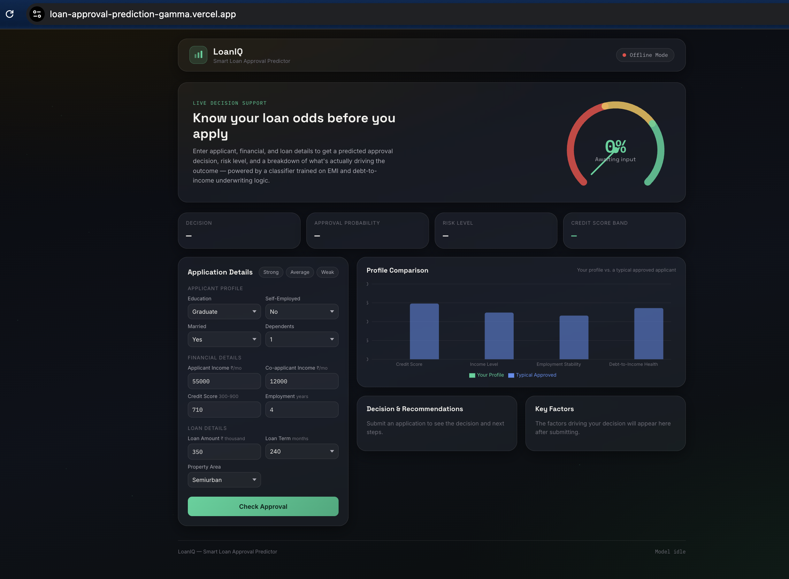
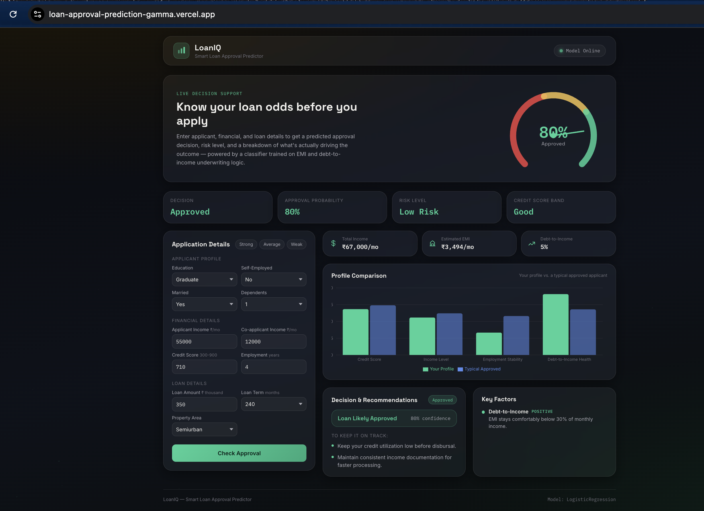

# 🏦 Loan Approval Prediction System

An end-to-end Machine Learning web application that predicts whether a loan application is likely to be **Approved** or **Rejected** based on applicant information.

The project combines a trained Machine Learning model, a Flask REST API backend, and a modern React + Vite frontend.

---

## 🚀 Live Demo

### 🌐 Frontend (Vercel)
https://loan-approval-prediction-gamma.vercel.app

### ⚙️ Backend API (Render)
https://loan-approval-prediction-z7ey.onrender.com

---

# ✨ Features

- Predicts loan approval instantly
- Modern responsive React UI
- Flask REST API backend
- Machine Learning powered predictions
- Data preprocessing & feature scaling
- Model metadata endpoint
- Production deployment using Vercel & Render

---

# 🛠️ Tech Stack

### Frontend
- React
- Vite
- Axios
- CSS

### Backend
- Python
- Flask
- Flask-CORS
- Gunicorn

### Machine Learning
- Scikit-learn
- Pandas
- NumPy
- Joblib

### Deployment
- Vercel
- Render
- GitHub

---

# 📂 Project Structure

```
loan-approval-prediction
│
├── backend
│   ├── app.py
│   ├── model.pkl
│   ├── scaler.pkl
│   ├── requirements.txt
│   └── model_metadata.json
│
├── frontend
│   ├── src
│   ├── package.json
│   ├── vite.config.js
│   └── .env.example
│
├── notebooks
│   └── train_model.py
│
├── data
│
├── outputs
│
└── README.md
```

---

# ⚙️ Installation

## Clone Repository

```bash
git clone https://github.com/riasingh1234/loan-approval-prediction.git

cd loan-approval-prediction
```

---

## Backend Setup

```bash
cd backend

python -m venv venv

source venv/bin/activate      # macOS/Linux

# OR

venv\Scripts\activate         # Windows

pip install -r requirements.txt

python app.py
```

Backend runs on

```
http://localhost:5000
```

---

## Frontend Setup

```bash
cd frontend

npm install

npm run dev
```

Frontend runs on

```
http://localhost:5173
```

---

# 🌐 Environment Variables

Create

```
frontend/.env
```

Add

```env
VITE_API_URL=http://localhost:5000
```

For production:

```env
VITE_API_URL=https://loan-approval-prediction-z7ey.onrender.com
```

---

# 📊 Machine Learning Workflow

- Data Cleaning
- Missing Value Handling
- Feature Encoding
- Feature Scaling
- Model Training
- Model Serialization
- REST API Deployment
- Frontend Integration

---

# 📷 Screenshots

## Home Page



## Prediction Result



---

# 📡 API Endpoints

## Health Check

```
GET /health
```

---

## Predict Loan Approval

```
POST /predict
```

Example Request

```json
{
  "Gender": 1,
  "Married": 1,
  "ApplicantIncome": 5000,
  "CoapplicantIncome": 2000,
  "LoanAmount": 150,
  "Loan_Amount_Term": 360,
  "Credit_History": 1,
  "Property_Area": 2
}
```

---

## Model Metadata

```
GET /metadata
```

---

# 🚀 Deployment

### Frontend

- Vercel

### Backend

- Render

---

# 📈 Future Improvements

- Probability Score
- SHAP Explainability
- Loan Risk Analysis
- User Authentication
- Prediction History
- Admin Dashboard
- Database Integration

---

# 👩‍💻 Author

**Ria Singh**

GitHub

https://github.com/riasingh1234

---

# INTERN ID : CITS4814

